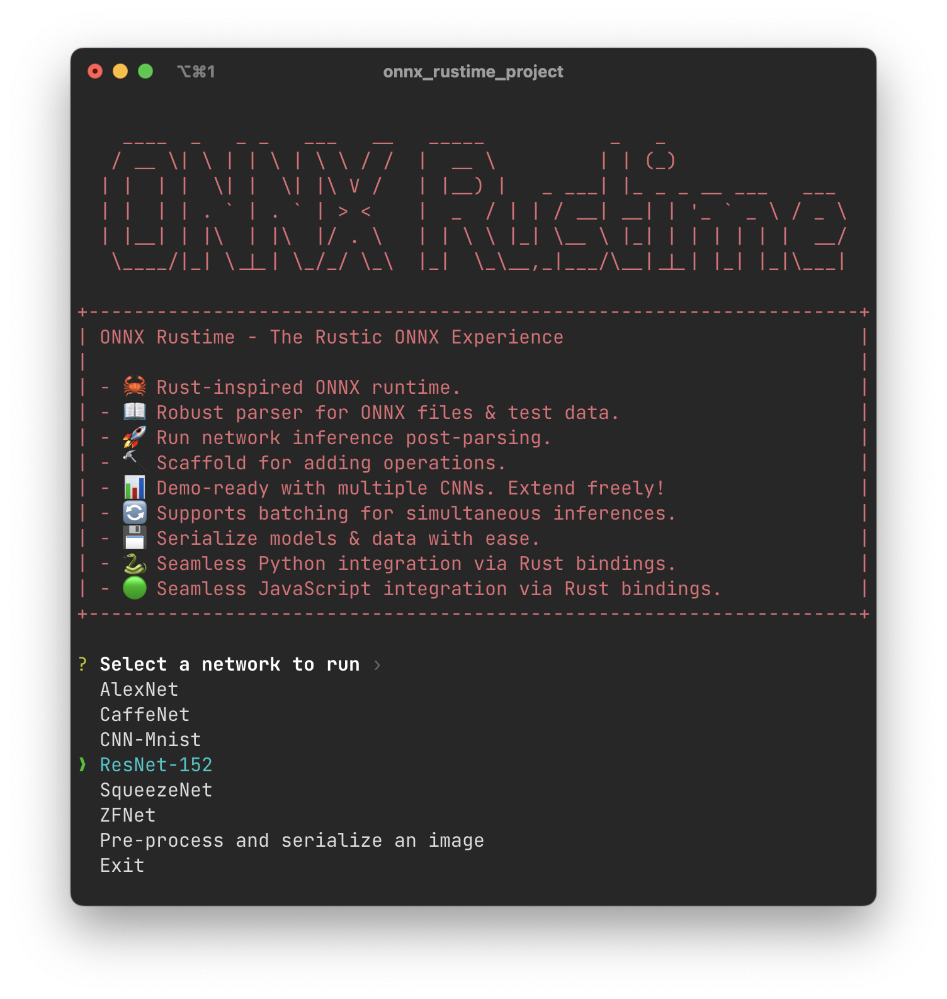
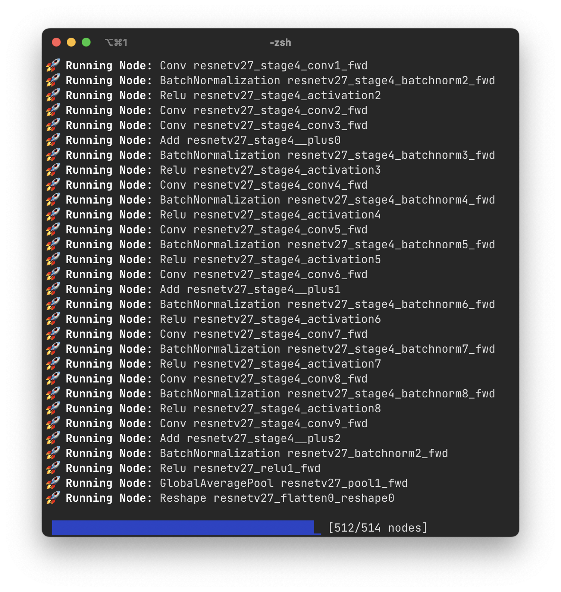
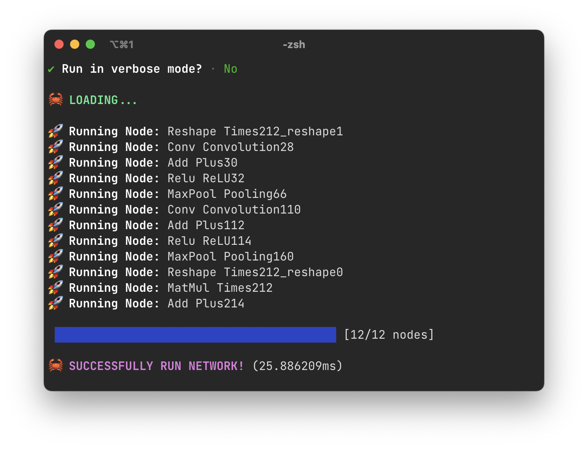
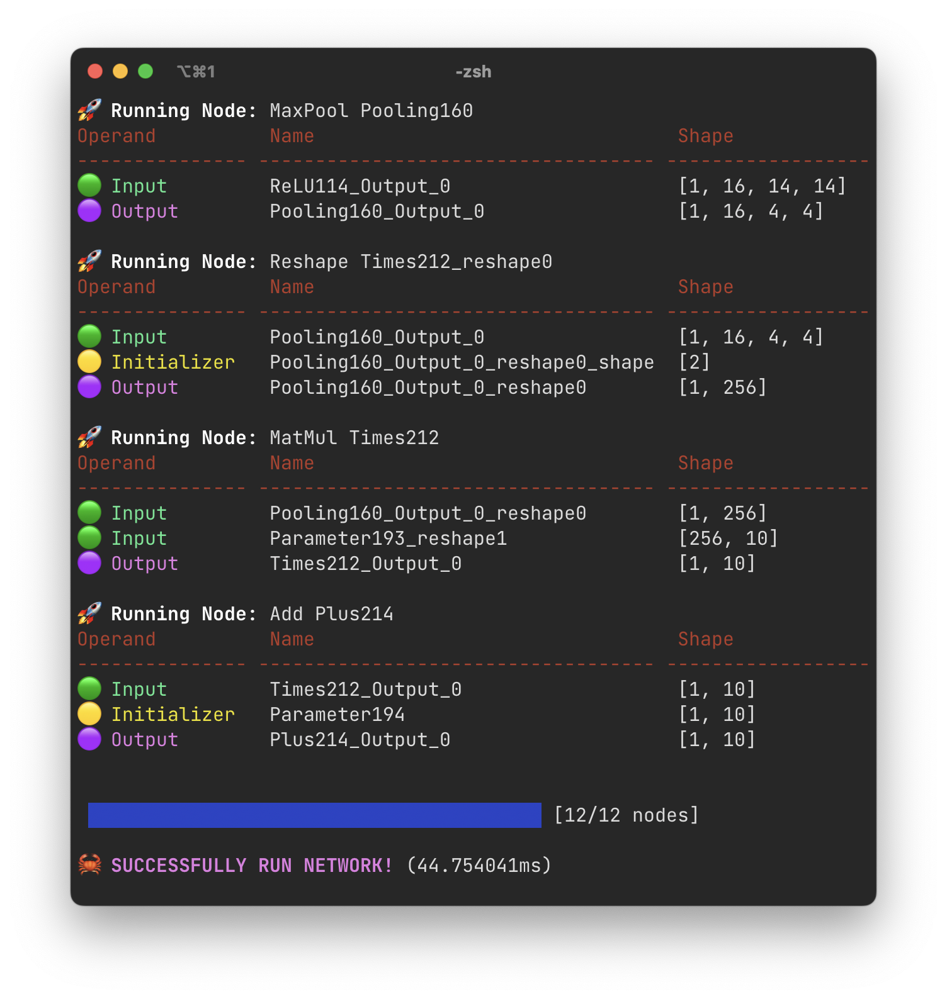
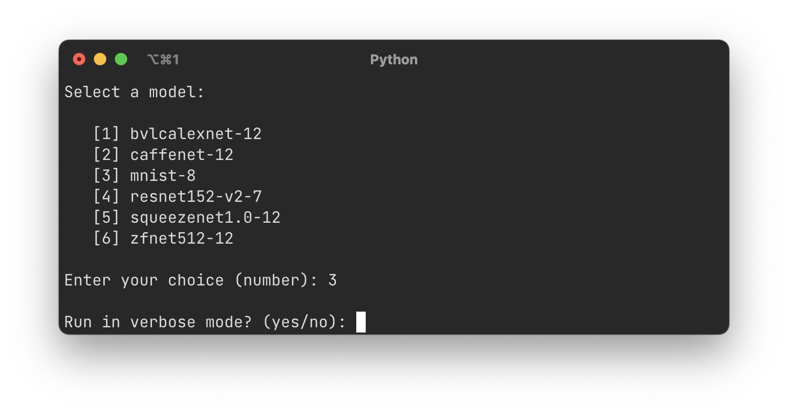
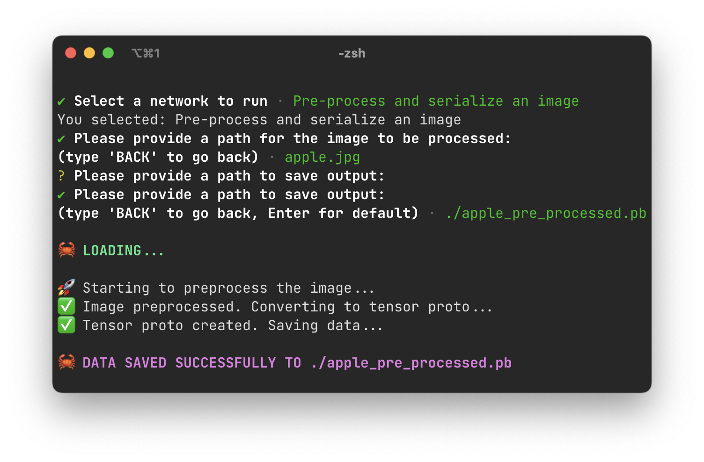

<div align="center">

# 🦀 ONNX Rustime - The Rustic ONNX Experience 🦀

Welcome to ONNX Rustime, a Rust-inspired **ONNX** runtime. <br>This project aims to provide a robust and efficient ONNX runtime experience with the power and safety of the **Rust** programming language.


</div>

# Table of Contents

- [🌟 Features](#-features)
- [⏳ How to install & use](#-how-to-install--use)
  - [Non verbose execution of a network](#non-verbose-execution-of-a-network)
  - [Verbose execution of a network](#verbose-execution-of-a-network)
  - [Setting Up the Python Environment for Rust Bindings](#setting-up-the-python-environment-for-rust-bindings)
  - [Setting Up the NodeJS Environment for Rust Bindings](#setting-up-the-nodejs-environment-for-rust-bindings)
- [📂 Project Structure](#-project-structure)
- [📊 ONNX Rustime Core Structures](#--onnx-rustime-core-structures)
  - [ONNX Rustime Structures Overview](#onnx-rustime-structures-overview)
  - [Origin of the Structures: Protocol Buffers Integration](#origin-of-the-structures-protocol-buffers-integration)
- [📖 ONNX Parser: Serialize and Deserialize models & data](#-onnx-parser-serialize-and-deserialize-models--data)
  - [Parser Key Features](#parser-key-features)
- [🚀 Running the ONNX Network with ONNX Rustime](#-running-the-onnx-network-with-onnx-rustime)
- [🛠️ Operations in ONNX Rustime](#%EF%B8%8F-operations-in-onnx-rustime)
  - [Operations Overview](#operations-overview)
  - [Supported Operations](#supported-operations)
  - [Extending ONNX Rustime with New Operations](#extending-onnx-rustime-with-new-operations)
- [📐 Automatic Data Preprocessing](#automatic-data-preprocessing)
  - [Preprocessing Steps for the ImageNet Dataset](#preprocessing-steps-for-the-imageNet-dataset)
- [🐍 Python-Rust Binding with ONNX Rustime](#-python-rust-binding-with-onnx-rustime)
  - [Python Rust Binding Overview](#python-rust-binding-overview)
  - [Exposed Python Functions](#exposed-python-functions)
  - [Usage](#usage)
- [🟢 JavaScript-Rust Binding with ONNX Rustime](#-javascript-rust-binding-with-onnx-rustime)
  - [JavaScript Rust Binding Overview](#javascript-rust-binding-overview)
  - [Exposed JavaScript Functions](#exposed-javascript-functions)
  - [Usage](#usage)
- [👩‍💻 Contribution](#-contribution)

---

## 🌟 Features

- 🦀 **Rust-inspired ONNX runtime**: Experience the power and safety of Rust combined with the flexibility of ONNX.
- 📖 **Robust parser for ONNX files & test data**: Deserialize ONNX files and their associated test data with ease and accuracy.
- 🚀 **Run network inference post-parsing**: Once your ONNX files are parsed, run network inferences seamlessly.
- 🔨 **Scaffold for adding operations**: You can easily extend this runtime with additional operations, so that more networks are supported.
- 📊 **Demo-ready with multiple CNNs**: The project comes with multiple convolutional neural networks ready for demonstration. Feel free to extend and experiment.
- 🔄 **Supports batching for simultaneous inferences**: Run multiple inferences simultaneously with the batching feature, leveraging [`rayon`](https://github.com/rayon-rs/rayon) for parallelization of batches.
- 💾 **Serialize models & data with ease**: Serialization made easy for both models and data.
- 🐍 **Seamless Python and JavaScript integration via Rust bindings**: Integrate with Python and JavaScript effortlessly using the provided Rust bindings.

## 🧠 Supported models

ONNX Rustime provides support for a set of **pre-trained** convolutional neural networks (CNNs) from the `vision / classification` section of the [ONNX Model Zoo](https://github.com/onnx/models):

| Model Name           | Description                                                                        |
| -------------------- | ---------------------------------------------------------------------------------- |
| **bvlcalexnet-12**   | A variant of the renowned AlexNet architecture.                                    |
| **caffenet-12**      | Inspired by the AlexNet model, optimized for the Caffe framework.                  |
| **mnist-8**          | Tailored for the MNIST dataset, specializing in handwritten digit recognition.     |
| **resnet152-v2-7**   | A deep model from the ResNet family with 152 layers.                               |
| **squeezenet1.0-12** | Lightweight model known for its efficiency while maintaining competitive accuracy. |
| **zfnet512-12**      | An improved model based on the AlexNet architecture.                               |

All these models, along with their test data, are available for download from the [ONNX Model Zoo](https://github.com/onnx/models). They can be easily integrated into ONNX Rustime for swift and accurate inferences.

The test data consists generally of 2 files:

- `input.pb`: the input of the network
- `output.pb`: the expected output of the network

For simplicity, the inputs and the expected outputs of the provided example networks are hardcoded in the `display.rs`, which manages the command line interface. This can be easily extended for other inputs & expected outputs.

## ⏳ How to install & use

Clone this repository and run it

```bash
git clone <this-repo-url>
cd <your root folder>
cargo run
```

You should be greeted with this interactive menu

After selecting one of the supported networks you will be shown a series of sub-menus.

- First, you will be asked whether to save the output data or not.
- If you select to save the data, you can choose a path to save your output. The output data will be saved as a serialized `.pb` file, which is the same format of the test data provided with the models.

Eventually, you will be asked whether to run the network in verbose mode or not.
Compare a non verbose execution with a verbose execution.

### Non verbose execution of a network




### Verbose execution of a network



### Setting Up the Python Environment for Rust Bindings

To set up the Python environment for Rust bindings, follow these steps:

1. Create a virtual environment from the root folder of the project:

   ```bash
   cd <your root folder>
   python3 -m venv ./py_onnx_rustime/rust-binding/
   ```

2. Activate the virtual environment:

   - For Linux and macOS:
     ```bash
     source py_onnx_rustime/rust-binding/bin/activate
     ```
   - For Windows:
     ```bash
     .\py_onnx_rustime\rust-binding\Scripts\activate
     ```

3. Install the [maturin](https://github.com/PyO3/maturin) package:

   ```bash
   pip install maturin
   ```

4. Build and install the Rust bindings, so that they will be accessible from Python code:

   ```bash
   maturin develop --release
   ```

5. Run the test demo from your environment:

   _Pay attention to be in the root folder of the project, as the two bindings demo have hard coded paths in them, and an execution from a different folder would result in an error._

   ```bash
   python3 ./py_onnx_rustime/test_onnx_rustime.py
   ```

You will be greeted with a barebone interactive menu, similar to the previous one:


After selecting the options, Python will call the Rust-powered functions for loading the chosen model & data, and running the model.

### Setting Up the NodeJS Environment for Rust Bindings

To set up the NodeJS environment for Rust bindings, follow these steps:

1. Install al the node module dependencies

   ```bash
   cd <your root folder>/js_onnx_rustime/
   npm i
   ```

2. Run the test demo from your environment:

   _Pay attention to be in the root folder of the project, as the two bindings demo have hard coded paths in them, and an execution from a different folder would result in an error._

   ```bash
   node ./js_onnx_rustime/test_onnx_rustime.js
   ```

You will be greeted with a barebone interactive menu, similar to the previous one:


_That's all!_ Now we will dwell into more technical details about the implementation. The following sections could be very useful to you if you seek to contribute to the project or simply understand it. 😉

## 📂 Project Structure

The following outlines the structure of the ONNX Rustime project. We will delve into the specifics of each part, providing insights into their purpose and how they integrate into the larger framework.

```
.
├── 📂 js_onnx_rustime         // javascript demo project
│ ├── package.json
│ └── test_onnx-rustime.js
├── 📂 models                 // pre-trained models with test data
│ ├── 📂 bvlcalexnet-12
│ ├── 📂 caffenet-12
│ ├── 📂 mnist-8
│ ├── 📂 resnet18-v2-7
│ ├── 📂 resnet152-v2-7
│ ├── 📂 squeezenet1.0-12
│ └── 📂 zfnet512-12
├── 📂 py_onnx_rustime        // python demo project
│ ├── 📂 rust-binding
│ ├── onnx_rustime_lib.pyi
│ └── test_onnx_rustime.py
├── 📂 screenshots
├── 📂 src
│ ├── 📂 onnx_rustime
│ │ ├── 📂 backend            // helper functions, parser, preprocessing, runtime functionalities
│ │ ├── 📂 onnx_proto         // ONNX data structures
│ │ ├── 📂 ops                // supported operations
│ │ ├── mod.rs
│ │ └── shared.rs             // global variable for verbose running
│ ├── display.rs              // display & menu functionalities
│ ├── lib.rs
│ └── main.rs
├── 📂 third_party
│ └── 📂 onnx                 // ONNX .proto files (more on this later!)
├── build.rs
├── Cargo.lock
├── Cargo.toml
├── LICENSE
└── README.md
```

## 📊 ONNX Rustime Core Structures

### ONNX Rustime Structures Overview

In ONNX Rustime, several Rust structures play pivotal roles in the operation of the runtime, especially in the file `src/onnx_rustime/onnx_proto/onnx_ml_proto3.rs`. These structures provide a layer of abstraction over the underlying data. Here are the most commonly used:

| Structure          | Description                                                                                                                                                                     |
| ------------------ | ------------------------------------------------------------------------------------------------------------------------------------------------------------------------------- |
| **ModelProto**     | Represents an entire ONNX model. It contains metadata about the model (like version and domain) and the actual data, which is the `GraphProto`.                                 |
| **GraphProto**     | Describes a computational graph. It contains nodes, inputs, outputs, and initializers (among other things). This is where the actual computation logic of the model is defined. |
| **TensorProto**    | Represents a tensor value. It can be an input, output, or an initializer. Contains data type, shape, and actual tensor values.                                                  |
| **NodeProto**      | Represents a node in the computational graph. Each node has an operator (like add, multiply), inputs, and outputs.                                                              |
| **ValueInfoProto** | Contains metadata about a tensor, such as its name, data type, and shape, but not the actual tensor values.                                                                     |

### Origin of the Structures: Protocol Buffers Integration

These Rust structures are generated from Protocol Buffers (often abbreviated as "protobuf") definitions specific to the ONNX framework. **Protocol Buffers**, developed by Google, is a method to serialize structured data, akin to XML or JSON.

The protobuf files are stored in `third_party/onnx`.<br>
They are in a `.proto` and `.proto3` format: the `.proto3` syntax is the latest version of Protocol Buffers.

**Note**: The `onnx.proto` files are sourced from the official ONNX repository and can be downloaded [here](https://github.com/onnx/onnx/tree/main/onnx).

<details>
  <summary><strong>Code Generation with <tt>build.rs</tt></strong></summary>

The Rust structures have been generated using the `build.rs` script, a customary build script in Rust projects. Here's a brief overview of the process:

1. **Setting Up**: The script initializes the environment and verifies the presence of `protoc` (the Protocol Buffers compiler) on the system.

2. **Defining Source Directory**: The `src_dir` macro specifies the directory containing the `.proto` and `.proto3` files.

3. **Code Generation**: Upon detecting `protoc`, the script employs the `protoc_rust` crate to produce Rust code from the designated `.proto3` files. This generated Rust code is stored in the `src/onnx_rustime/onnx_proto` directory. The primary files for this process are:
   - `onnx-ml.proto3`
   - `onnx-operators-ml.proto3`
   - `onnx-data.proto3`

</details>

<details>
  <summary><strong>Note on Compilation</strong></summary>

The necessary libraries are already pre-compiled, so you don't need to have `protoc` installed for general use. However, if you wish to compile them on your own (perhaps to integrate a new version of the protobuf), you can:

- Download `protoc` for your system from the [official Protocol Buffers GitHub repository](https://github.com/protocolbuffers/protobuf/releases).
- Obtain the desired `.proto` files from the [official ONNX GitHub repository](https://github.com/onnx/onnx/tree/main/onnx).
- Modify the paths in the `build.rs` script to point to your new `.proto` files.
- Run `cargo build` to compile.

This flexibility ensures that you can always stay updated with the latest developments in the Protocol Buffers ecosystem.

</details>

## 📖 ONNX Parser: Serialize and Deserialize models & data

The ONNX Parser in ONNX Rustime, as defined in `src/onnx_rustime/backend/parser.rs`, provides functionalities to interpret and handle ONNX data structures. It leverages the Protocol Buffers format to serialize and deserialize ONNX models and data. The `OnnxParser` struct encapsulates the following functionalities.

### Parser Key Features

1. **Model Loading**: With `load_model`, you can load an ONNX model from a specified path. This function reads the file, deserializes it, and returns a `ModelProto` structure representing the entire ONNX model.

   ```rust
   pub fn load_model(path: String) -> Result<ModelProto, OnnxError>
   ```

1. **Data Loading**: The `load_data` function allows you to load tensor data from a given path. It returns a `TensorProto` structure, which represents a tensor value in ONNX.

   ```rust
   pub fn load_data(path: String) -> Result<TensorProto, OnnxError>
   ```

1. **Model and Data Saving**: Although not primarily used, the parser also offers functionalities to save a given `ModelProto` or `TensorProto` back to a file. This can be useful for scenarios where modifications to the model or data are made and need to be persisted.

   ```rust
   pub fn save_model(model: &ModelProto, path: String) -> Result<(), OnnxError>
   pub fn save_data(tensor: &TensorProto, path: String) -> Result<(), OnnxError>
   ```

1. **Data Parsing**: The parser can convert raw byte data into floating-point values (`parse_raw_data_as_floats`) and 64-bit integers (`parse_raw_data_as_ints64`). This is essential for interpreting tensor data stored in the raw byte format inside the `TensorProto`.

   ```rust
   pub fn parse_raw_data_as_floats(raw_data: &[u8]) -> Vec<f32>
   pub fn parse_raw_data_as_ints64(raw_data: &[u8]) -> Vec<i64>
   ```

## 🚀 Running the ONNX Network with ONNX Rustime

ONNX Rustime offers a streamlined way to execute ONNX models. Here's a breakdown of the core functions that facilitate this process:

The `run` function serves as the primary gateway for executing an ONNX model. It processes the nodes of the model's graph in the sequence they are defined, manages initializers, and ensures the output of one node is correctly routed as the input for subsequent nodes.

```rust
pub fn run(
   model: &ModelProto,
   input_tensor: TensorProto
) -> TensorProto;
```

- It begins by extracting the graph from the provided model.
- Each node in the graph is executed in sequence in the `run_node` function.
- A progress bar provides a visual representation of the node execution process.
- The function concludes by returning the output tensor for the entire model.

The `run_node` function is responsible for executing a specific node within the ONNX graph. It identifies the node's operation type and then invokes the corresponding execution function, supplying the necessary inputs and initializers.

```rust
fn run_node(
   node: &NodeProto,
   inputs: &Vec<&TensorProto>,
   initializers: &Vec<&TensorProto>,
) -> Result<TensorProto, OnnxError>;
```

- The node's operation type is mapped to its execution function.
- The node is executed based on its operation type using the provided inputs.
- If the operation type isn't recognized, an error is returned.

To execute a network, load your ONNX model and input tensor, and then call the `run` function. Ensure your model and input tensor are compatible and that the model's operations have been implemented.

```rust
let model = OnnxParser::load_model(model_path).unwrap();
let input = OnnxParser::load_data(input_path).unwrap();
let expected_output = OnnxParser::load_data(output_path).unwrap();

// Run the model
let predicted_output = run(&model, input);
```

## 🛠️ Operations in ONNX Rustime

### Operations Overview

In ONNX Rustime, operations are the backbone of the neural network execution. These operations are housed within the `src/onnx_rustime/ops` directory. At the heart of these operations is the [`ndarray`](https://github.com/rust-ndarray/ndarray) library, a versatile tool for array computations in Rust.

When an operation is invoked, `TensorProto` objects are provided as inputs. These objects are then converted into `ndarray` arrays for efficient computation inside the operation function. This conversion is facilitated by utility functions such as:

```rust
tensor_proto_to_ndarray<T: TensorType>(
   tensor: &TensorProto
) -> Result<ArrayD<T::DataType>, OnnxError>
```

```rust
convert_to_output_tensor(
   node: &NodeProto,
   result: ArrayD<f32>
) -> Result<TensorProto, OnnxError>
```

- Pre-operation, the function `tensor_proto_to_ndarray` takes a `TensorProto` object and converts it into an `ndarray` array of a specified type.

- Post-operation, the function `convert_to_output_tensor` assists in converting the computed `ndarray` array back into a `TensorProto` object, ensuring consistency with the ONNX standard. The node is needed to extract the output name, which will be used by next operations to identify their inputs.

All the operations and utility functions return a `Result` type, which encapsulates either the desired output or an `OnnxError`. This specialized error type, defined in `src/onnx_rustime/backend/helper.rs`, provides detailed error messages tailored to various scenarios that might arise during the execution of ONNX operations.

### Supported operations

**Add**: Element-wise tensor addition.

```rust
pub fn add(
    inputs: &Vec<&TensorProto>,
    initializers: Option<&Vec<&TensorProto>>,
    node: &NodeProto,
) -> Result<TensorProto, OnnxError>;
```

**Batch Normalization**: Normalizes the activations of a given input volume.

```rust
pub fn batch_normalization(
    input: &TensorProto,
    initializers: &Vec<&TensorProto>,
    node: &NodeProto,
) -> Result<TensorProto, OnnxError>;
```

**Concat**: Concatenates tensors along a specified axis.

```rust
pub fn concat(
    inputs: &Vec<&TensorProto>,
    node: &NodeProto,
) -> Result<TensorProto, OnnxError>;
```

**Conv**: Fundamental convolution operation for CNNs.

We adapted the original implementation of [convolution-rs](https://github.com/Conzel/convolutions-rs) in order to support multiple batch convolution, with group selection and dilation.

```rust
pub fn conv(
    input: &TensorProto,
    initializers: &Vec<&TensorProto>,
    node: &NodeProto,
) -> Result<TensorProto, OnnxError>;
```

**Dropout**: Regularization technique where randomly selected neurons are ignored during training.

```rust
pub fn dropout(
    input: &TensorProto,
    initializers: Option<&Vec<&TensorProto>>,
    node: &NodeProto,
) -> Result<TensorProto, OnnxError>;
```

**Exp**: Computes the exponential of the given input tensor.

```rust
pub fn exp(
    input: &TensorProto,
    node: &NodeProto,
) -> Result<TensorProto, OnnxError>;
```

**Flatten**: Flattens the input tensor into a 2D matrix.

```rust
pub fn flatten(
    input: &TensorProto,
    node: &NodeProto,
) -> Result<TensorProto, OnnxError>;
```

**Gemm**: General Matrix Multiplication. Computes matrix multiplication and possibly followed by addition.

```rust
pub fn gemm(
    inputs: &Vec<&TensorProto>,
    initializers: Option<&Vec<&TensorProto>>,
    node: &NodeProto,
) -> Result<TensorProto, OnnxError>;
```

**Global Average Pool**: Computes the average of the entire input tensor.

```rust
pub fn global_average_pool(
    input: &TensorProto,
    node: &NodeProto,
) -> Result<TensorProto, OnnxError>;
```

**LRN**: Local Response Normalization used in deep learning.

```rust
pub fn lrn(
    input: &TensorProto,
    node: &NodeProto,
) -> Result<TensorProto, OnnxError>;
```

**MatMul**: Matrix multiplication operation.

```rust
pub fn matmul(
    inputs: &Vec<&TensorProto>,
    initializers: &Vec<&TensorProto>,
    node: &NodeProto,
) -> Result<TensorProto, OnnxError>;
```

**MaxPool**: Down-samples an input representation using max pooling.

```rust
pub fn maxpool(
    input: &TensorProto,
    node: &NodeProto,
) -> Result<TensorProto, OnnxError>;
```

**Reduce Sum**: Computes the sum of all or specific axes of the input tensor.

```rust
pub fn reduce_sum(
    input: &TensorProto,
    node: &NodeProto,
) -> Result<TensorProto, OnnxError>;
```

**ReLU**: Rectified Linear Unit activation function.

```rust
pub fn relu(
    input: &TensorProto,
    node: &NodeProto,
) -> Result<TensorProto, OnnxError>;
```

**Reshape**: Reshapes the input tensor to a new shape.

```rust
pub fn reshape(
    input: Option<&TensorProto>,
    initializers: &Vec<&TensorProto>,
    node: &NodeProto,
) -> Result<TensorProto, OnnxError>;
```

**Softmax**: Computes the softmax activations for the input tensor.

```rust
pub fn softmax(
    input: &TensorProto,
    node: &NodeProto,
) -> Result<TensorProto, OnnxError>;
```

### Extending ONNX Rustime with New Operations

For developers keen on extending ONNX Rustime's capabilities, adding new operations is very easy:

1. **Implement the Operation**: Create a new file inside the `src/onnx_rustime/ops` directory and define your operation. Ensure you utilize the utility functions for consistent tensor conversions.

2. **Integrate with the Execution Flow**: Modify the `run_node` function to recognize and execute your newly added operation.

This modular and developer-friendly design ensures that ONNX Rustime remains extensible, catering to evolving neural network architectures and operations.

## 📐 Automatic Data Preprocessing

ONNX Rustime simplifies data preprocessing for the ImageNet dataset.

You can select any image (in all common formats) and produce a serialized pb file. This serialized pb file is a representation of the pre processed image.

You can find the corresponding code on src/backend/pre_processing.rs.

You can then use this serialized pb file as an input for your network to test it out.
Currently, this preprocessing step works best for the ResNet model.

### Preprocessing Steps for the ImageNet Dataset

Our preprocessing pipeline for the ImageNet dataset involves the following steps:

1. Rescaling: We begin by rescaling the image to a size of 256 pixels while maintaining the original image's proportions.
2. Center Cropping: Next, we perform center cropping, reducing the image size to a standardized 224 by 224 dimensions.
3. Data Type Conversion: Following cropping, we convert pixel values to floating-point data type and normalize them.
4. Channel Separation: The RGB image is split into three separate channels to create a tensor of shape 3x224x224.
5. Protobuf Conversion: Finally, we convert the preprocessed image into a protobuf file. This file can be used as input for further executions without requiring additional preprocessing steps.

This automatic data preprocessing enhances the efficiency and consistency of working with the ImageNet dataset, facilitating seamless integration into your ResNet model training pipeline.

Here is an example of the preprocessing execution:


## 🐍 Python-Rust Binding with ONNX Rustime

The ONNX Rustime project provides a basic integration between Python and Rust, allowing users to harness the power of Rust's performance and safety while working within the Python ecosystem. This integration is achieved using the [PyO3](https://github.com/PyO3/pyo3) library, which facilitates the creation of Python modules and native extensions in Rust.

### Python-Rust Binding Overview

The binding exposes several functions that allow Python users to interact with the ONNX runtime implemented in Rust. Key data structures like `ModelProto` and `TensorProto` from the ONNX specification are wrapped in IDs. These IDs act as opaque pointers, abstracting away the underlying Rust details from the Python side. This design ensures a clean separation between the two languages and hides the intricacies of the Rust implementation.

### Exposed Python Functions

Here's a brief overview of the Python functions generated by the binding:

```python
py_load_model(path: str) -> int
```

- Loads an ONNX model from the provided path.
- Returns an ID corresponding to the loaded `ModelProto`.

```python
py_load_data(path: str) -> int
```

- Loads ONNX data (`TensorProto`) from the provided path.
- Returns an ID corresponding to the loaded `TensorProto`.

```python
py_print_data(data_id: int) -> None
```

- Prints the ONNX data (`TensorProto`) associated with the provided ID.

```python
py_run(model_id: int, input_data_id: int, verbose: bool) -> int
```

- Runs the ONNX model with the provided input data.
- Returns an ID corresponding to the output `TensorProto`.

```python
py_display_outputs(predicted_data_id: int, expected_data_id: int) -> None
```

- Displays the predicted and expected outputs in a user-friendly format.

Within the `lib.rs` file, the Rust functions are exposed to Python using the `pymodule` mechanism. The module is named `onnx_rustime_lib`, aligning with the name specified in the `Cargo.toml` lib section.

Here's the module definition:

```rust
#[pymodule]
fn onnx_rustime_lib(_py: Python, m: &PyModule) -> PyResult<()> {
    m.add_function(wrap_pyfunction!(py_load_model, m)?)?;
    m.add_function(wrap_pyfunction!(py_load_data, m)?)?;
    m.add_function(wrap_pyfunction!(py_print_data, m)?)?;
    m.add_function(wrap_pyfunction!(py_run, m)?)?;
    m.add_function(wrap_pyfunction!(py_display_outputs, m)?)?;

    Ok(())
}
```

When using this library in Python, you should import it as:

```python
import onnx_rustime_lib
```

This allows you to access and utilize the defined Rust functions seamlessly within your Python environment.

### Usage

To use the Python-Rust binding, you'll first need to set up the Python environment as described in the main README section. Once the environment is set up, you can directly call the provided Python functions to interact with the ONNX runtime.

For example, to load an ONNX model and run it with some input data:

```python
import onnx_rustime_lib as onnx_rustime

model_id = onnx_rustime.py_load_model("path_to_model.onnx")
data_id = onnx_rustime.py_load_data("path_to_input_data.pb")
output_id = onnx_rustime.py_run(model_id, data_id, verbose=True)
```

As discussed in the usage section, a test demo example is provided in `./py_onnx_rustime/test_onnx_rustime.py`.

For more details on how Rust and Python integration works, and to dive deeper into the capabilities of PyO3, visit the [official PyO3 documentation](https://pyo3.rs/v0.15.0/).

## 🟢 JavaScript-Rust Binding with ONNX Rustime

The ONNX Rustime project provides a basic integration between JavaScript and Rust, allowing users to harness the power of Rust's performance and safety while working within the JavaScript ecosystem. This integration is achieved using the [neon](https://github.com/neon-bindings/neon) library, which facilitates the creation of JavaScript modules and native extensions in Rust.

### JavaScript-Rust Binding Overview

The binding exposes several functions that allow JavaScript users to interact with the ONNX runtime implemented in Rust. Key data structures like `ModelProto` and `TensorProto` from the ONNX specification are wrapped in IDs. These IDs act as opaque pointers, abstracting away the underlying Rust details from the JavaScript side. This design ensures a clean separation between the two languages and hides the intricacies of the Rust implementation.
All the function arguments are passed behind a ModuleContext struct, and outputs are wrapped around a JSResult struct.

### Exposed JavaScript Functions

Here's a brief overview of the JavaScript functions generated by the binding.
First you find the Rust function signature and then the corresponding JavaScript exposed function.

```rust
js_load_model(cx: mut ModuleContext) -> JsResult<JsNumber>
```

```javascript
js_load_model(path: str) -> int
```

- Loads an ONNX model from the provided path.
- Returns an ID corresponding to the loaded `ModelProto`.

```rust
js_load_data(cx: mut ModuleContext) -> JsResult<JsNumber>
```

```javascript
js_load_data(path: str) -> int
```

- Loads ONNX data (`TensorProto`) from the provided path.
- Returns an ID corresponding to the loaded `TensorProto`.

```rust
js_print_data(cx: mut ModuleContext) -> JsResult<JsUndefined>
```

```javascript
js_print_data(data_id: int) -> undefined
```

- Prints the ONNX data (`TensorProto`) associated with the provided ID.

```rust
js_run(cx: mut ModuleContext) -> JsResult<JsNumber>
```

```javascript
js_run(model_id: int, input_data_id: int, verbose: bool) -> int
```

- Runs the ONNX model with the provided input data.
- Returns an ID corresponding to the output `TensorProto`.

```rust
js_display_outputs(cx: mut ModuleContext) -> JsResult<JsUndefined>
```

```javascript
js_display_outputs(predicted_data_id: int, expected_data_id: int) -> undefined
```

- Displays the predicted and expected outputs in a user-friendly format.

The module is named `onnx_rustime_lib`, aligning with the name specified in the `Cargo.toml` lib section.

Here's the module definition:

```rust
    #[neon::main]
    fn main(mut cx: ModuleContext) -> NeonResult<()> {
        cx.export_function("js_load_model", js_load_model)?;
        cx.export_function("js_load_data", js_load_data)?;
        cx.export_function("js_print_data", js_print_data)?;
        cx.export_function("js_run", js_run)?;
        cx.export_function("js_display_outputs", js_display_outputs)?;

        Ok(())
    }
```

When using this library in JavaScript, you should import it as:

```javascript
const onnx_rustime = require(".");
```

This allows you to access and utilize the defined Rust functions seamlessly within your JavaScript environment.

### Usage

To use the JavaScript-Rust binding, you'll first need to install all the required node modules, as described in the main README section. Once the environment is set up, you can directly call the provided JavaScript functions to interact with the ONNX runtime.

For example, to load an ONNX model and run it with some input data:

```javascript
const onnx_rustime = require(".");

model_id = onnx_rustime.js_load_model("path_to_model.onnx");
data_id = onnx_rustime.js_load_data("path_to_input_data.pb");
output_id = onnx_rustime.js_run(model_id, data_id, True);
```

As discussed in the usage section, a test demo example is provided in `./js_onnx_rustime/test_onnx_rustime.js`.

For more details on how Rust and JavaScript integration works, and to dive deeper into the capabilities of neon, visit the [official neon documentation](https://docs.rs/neon/latest/neon/).

## 👩‍💻 Contribution

Feel free to contribute to this project by extending its functionalities, adding more operations, or improving the existing ones. Your contributions are always welcome!
c